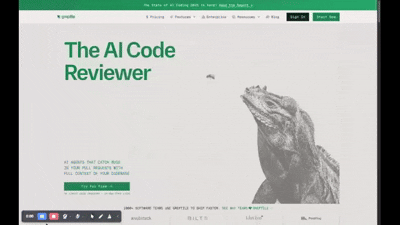

# deepseek-r1:8b and llama4:scout running together
Dockerized Open-WebUI Ollama setup to run two (and more) models simultaneously





Entrypoint script downloads deepseek-r1:8b and llama4:scout models automatically

## 📋 Prerequisites
- Docker Engine v20.10.10+
- Docker Compose v2.20.0+
- 80GB+ RAM (minimum)
- 130GB+ free disk space

## 🚀 Quick Start
1. **Clone the repo**
```bash
git clone https://github.com/svirmi/ollama-open-webui.git
```
2. **Start Services**
```bash
cd ollama-open-webui 
```
```
docker compose up --build
```

3. **Verify Installation**
```bash
docker compose ps
```
Expected Output:
| NAME | COMMAND | SERVICE | STATUS | PORTS |
|------|---------|---------|--------|-------|
| ollama | "/bin/ollama serve" | ollama | running | 0.0.0.0:11434->11434/tcp |
| open-webui | "bash start.sh" | open-webui | running | 0.0.0.0:3000->8080/tcp |

4. **Check Logs**
```bash
docker compose logs -f ollama
docker compose logs -f open-webui
```

5. **Uninstall**
```bash
docker compose down --volumes --rmi all
```

## 🌐 Access the Web UI
1. Open browser to `http://localhost:3000`
2. Create admin account
3. Select **both** models at the top-left corner
4. Start chatting
